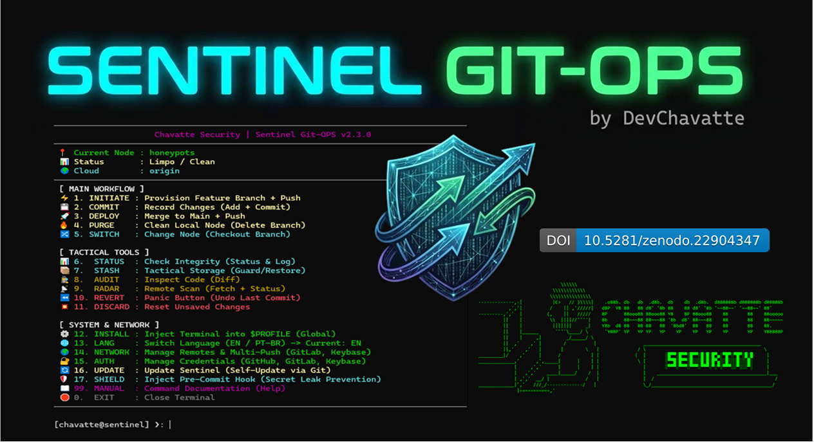

<pre style="font-size: 0.5rem;">

                              \\\\\\
                           \\\\\\\\\\\\
                          \\\\\\\\\\\\\\\
-------------,-|           |C>   // )\\\\|    .o88b. db   db  .d8b.  db    db  .d8b.  d888888b d888888b d88888b
           ,','|          /    || ,'/////|   d8P  Y8 88   88 d8' '8b 88    88 d8' '8b '~~88~~' '~~88~~' 88'  
---------,','  |         (,    ||   /////    8P      88ooo88 88ooo88 Y8    8P 88ooo88    88       88    88ooooo 
         ||    |          \\  ||||//''''|    8b      88~~~88 88~~~88 '8b  d8' 88~~~88    88       88    88~~~~~ 
         ||    |           |||||||     _|    Y8b  d8 88   88 88   88  '8bd8'  88   88    88       88    88.   
         ||    |______      ''''\____/ \      'Y88P' YP   YP YP   YP    YP    YP   YP    YP       YP    Y88888P
         ||    |     ,|         _/_____/ \
         ||  ,'    ,' |        /          |                 ___________________________________________
         ||,'    ,'   |       |         \  |              / \                                           \ 
_________|/    ,'     |      /           | |             |  |                                            | 
_____________,'      ,',_____|      |    | |              \ |      chavatte@duck.com                     | 
             |     ,','      |      |    | |                |                       chavatte.vercel.app  | 
             |   ,','    ____|_____/    /  |                |    ________________________________________|___
             | ,','  __/ |             /   |                |  /                                            /
_____________|','   ///_/-------------/   |                 \_/____________________________________________/ 
              |===========,'                                                                  
			  

</pre>

<div align="center">
  
  <h1>🛡️ Sentinel Git-OPS (v2.3.1)</h1>
  <p><strong>A DevSecOps Tactical CLI for Standardized & Secure Git Workflows</strong></p>

[](https://doi.org/10.5281/zenodo.22904347) [](https://opensource.org/licenses/MIT) 
[](https://docs.microsoft.com/en-us/powershell/) [](https://www.gnu.org/software/bash/) [](https://git-scm.com/)

  <br>

  **[ 🇺🇸 English ](README.md)** &nbsp; | &nbsp; **[ 🇧🇷 Português ](README.pt-br.md)**

</div>

---

## 📖 Table of Contents

- [Overview](#-overview)
- [Architecture &amp; Features](#-architecture--features)
- [Prerequisites](#-prerequisites)
- [Installation &amp; Global Setup](#-installation--global-setup)
- [Command Reference](#-command-reference)
- [DevSecOps Use Cases](#-devsecops-use-cases)
- [Security Policy](#-security-policy)

---

## 📌 Overview

**Sentinel Git-OPS**, developed by **Chavatte Security**, is an interactive, menu-driven Command Line Interface designed to harden and automate the Git development lifecycle.

By replacing raw, repetitive Git commands with a guided terminal experience, Sentinel minimizes operational human errors (e.g., accidental pushes to main, unreviewed commits) and introduces DevSecOps principles directly into the developer's daily workflow.

## 🏗️ Architecture & Features

Built with **Clean Code** principles, **v2.3.1** introduces a highly modular architecture where the core router is strictly separated from logical actions and dynamic i18n dictionaries.

* 📊 **Tactical Dashboard:** Real-time telemetry displaying the current node (branch), file modification status, and connected cloud networks directly in the terminal header.
* 🛡️ **Shield Ops (Pre-Commit Hook):** Injects a security script to actively scan and block commits containing exposed secrets (AWS keys, RSA keys, GitHub tokens).
* 🔄 **Self-Update Protocol:** Keep your CLI updated with a single keystroke using the built-in self-pull mechanism.
* 🌐 **Omnicast Multi-Push:** Added extended support for **GitLab** and **Keybase** as additional network infrastructures. Deploy your codebase simultaneously across multiple remote environments by simply targeting `ALL`.
* 🔐 **Auth-Ops & Authorization Layer:** Independent identity management module with native support for CLI login and authorization across **GitHub**, **GitLab**, and **Keybase**. Forge highly secure `Ed25519` SSH keys directly from the tool.
* 💻 **True Cross-Platform:** Native execution environments for Windows (PowerShell) and Linux/macOS (Bash/Zsh).
* 🌍 **Native i18n:** Swap between English and Portuguese interfaces in real-time.

## ⚙️ Prerequisites

Ensure your environment meets the following requirements before deploying Sentinel:

- **Git** `v2.0` or higher.
- **Windows:** PowerShell `5.1` or PowerShell Core `7+`.
- **Linux/macOS:** Standard `bash` or `zsh` environment.
- *(Optional)* GitHub CLI (`gh`), GitLab CLI (`glab`), or Keybase app for the Auth-Ops module.

---

## 🚀 Installation & Global Setup

Sentinel Git-OPS features a built-in global injector. You do not need to manually configure your PATH.

### For Windows Environments

```powershell
# 1. Clone the repository
git clone https://github.com/chavatte/sentinel-git-ops.git
cd sentinel-git-ops

# 2. Launch the terminal
.\win\git-ops.ps1
```


> **Make it Global:** Once the menu is open, select option `[12] INSTALL`. Sentinel will automatically configure your Execution Policies and inject its alias into your `$PROFILE`.

### For Linux/macOS Environments


```
# 1. Clone the repository
git clone https://github.com/chavatte/sentinel-git-ops.git
cd sentinel-git-ops

# 2. Grant execution permissions
chmod +x linux/git-ops.sh linux/core/*.sh

# 3. Launch the terminal
./linux/git-ops.sh
```

> **Make it Global:** Select option `[12] INSTALL`. Sentinel will write an alias directly into your `~/.bashrc` or `~/.zshrc`.

---

## 🛠️ Command Reference

| **Category** | **Command** | **Description**                                                       |
| ------------------ | ----------------- | --------------------------------------------------------------------------- |
| **Workflow** | `1. INITIATE`   | Provisions a new branch and links it to the remote instantly.               |
| **Workflow** | `2. COMMIT`     | Stages changes and records a local commit after showing modified files.                  |
| **Workflow** | `3. DEPLOY`     | Switches to main, pulls updates, merges the feature, and pushes.            |
| **Workflow** | `4. PURGE`      | Safely deletes a local branch to maintain node hygiene.                     |
| **Workflow** | `5. SWITCH`     | Interactive checkout between existing local nodes.                          |
| **Tactical** | `6. STATUS`     | Displays repository health and the recent chronological commit tree.        |
| **Tactical** | `7. STASH`      | Quick access to stash push, pop, and list commands.                         |
| **Tactical** | `8. AUDIT`      | Opens an unstaged or staged diff for review.        |
| **Tactical** | `9. RADAR`      | Runs `git fetch --all` and displays repository status.        |
| **Tactical** | `10. REVERT`    | **Panic Button:** Runs `git reset --soft HEAD~1` to rewrite the most recent local commit while preserving changes. |
| **Tactical** | `11. DISCARD`   | **Destruction Protocol:** Runs `git restore .` to discard tracked working-tree changes.               |
| **System**   | `12. INSTALL`   | Injects the terminal alias globally into your system.                       |
| **System**   | `13. LANG`      | Toggles UI language (EN / PT-BR).                                           |
| **System**   | `14. NETWORK`   | Manage remotes and enable Omnicast Multi-Push routing.                      |
| **System**   | `15. AUTH`      | Manage Credentials and forge secure SSH keys (Ed25519).                     |
| **System**   | `16. UPDATE`    | **Self-Update:** Automatically pulls the latest Sentinel version.            |
| **System**   | `17. SHIELD`    | **Shield Ops:** Installs an optional pattern-based pre-commit hook to detect common secret formats.             |

---

## 📚 DevSecOps Use Cases

### 1. Multi-Remote Redundancy (Omnicast)

Keeping more than one remote can improve operational redundancy, but it is not a substitute for backup, access control, or repository security.

1. Open the terminal and select `14` ( **NETWORK** ).
2. Choose `1` to link a new remote (e.g., name it `gitlab` and paste the URL).
3. During any `INITIATE` or `DEPLOY` operation, when prompted for the target remote, type `ALL`.
4. Sentinel will broadcast your code to *both* GitHub and GitLab simultaneously.

### 2. Pattern-Based Secret Detection (Shield Ops)

Use the optional hook as an additional local check for common credential formats. It can produce false positives/negatives and can be bypassed with `git commit --no-verify`, so dedicated secret scanning remains recommended.

1. Run option `17` ( **SHIELD** ) inside your project.
2. If a developer attempts to commit an exposed credential (like an AWS key or GitHub token), Sentinel intercepts the process.
3. The commit is instantly **blocked** with an alert detailing the file and the matched secret pattern.

### 3. Local Commit Recovery

If you accidentally staged a broken function or need to rework your last commit:

1. Immediately press `10` ( **REVERT** ).
2. Sentinel executes a surgical `git reset --soft HEAD~1`.
3. This rewrites the most recent local commit while preserving the changes in the index. Use it for local/unpublished history; for shared history, prefer a corrective commit or `git revert`.

---

## 📝 Security Notes

Sentinel can modify repository state, shell profiles, remotes, and Git hooks. Review command output before using destructive or history-rewriting options. The Shield feature is a limited pattern-based check and is not a replacement for dedicated secret-scanning systems.

## 📚 Citation

If you use Sentinel Git-OPS in research, education publications, or software engineering studies, please cite version 2.3.1 using the following DOI:

**DOI:** https://doi.org/10.5281/zenodo.22904347

### Recommended citation

Chavatte, João Carlos. 2026. *Sentinel Git-OPS: A DevSecOps Tactical CLI for Standardized and Secure Git Workflows* Version 2.3.1. Zenodo. https://doi.org/10.5281/zenodo.22904347

## 🛡️ Security Policy

As a project maintained by  **Chavatte Security** , we take the integrity of our tools seriously. If you discover a vulnerability or a potential attack vector within the CLI scripts (e.g., command injection flaws), please **do not** open a public issue. See [`SECURITY.md`](SECURITY.md) for the private reporting process.

## 📝 License & Authorship

This project is distributed under the **MIT** license. See the `LICENSE` file for details.

